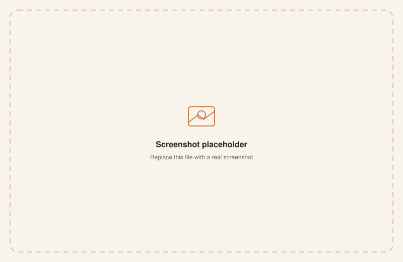

# PRAHARI

**AI-powered mine compliance and safety monitoring platform.**

A dashboard for tracking mine inspections, safety violations, and environmental readings, with an AI copilot and automated risk scoring layered on top. Built for **Smart India Hackathon**.

<br/>


<br/>

## Problem

Mine safety and environmental compliance generates a constant stream of inspection reports, violations, and readings — spread across paper records and disconnected systems. PRAHARI centralizes that data and adds automated risk scoring so patterns don't get lost in the backlog.

<br/>

## Features

| Feature | Description |
|:--|:--|
| Mine registry | Central record of mines under monitoring (`api/mines`) |
| Inspections | Logged inspection records per mine (`api/inspections`) |
| Violations | Tracked compliance violations (`api/violations`) |
| Environmental readings | Recorded environmental data per site (`api/environmental-readings`) |
| Alerts | Active alerts surfaced from readings and violations (`api/alerts`) |
| AI risk scoring | Automated risk score per mine (`api/ai/risk-score`) |
| AI copilot | Conversational assistant over platform data (`api/copilot/chat`) |
| Reports | Generated compliance reports (`api/reports`) |
| Audit logs | Full audit trail of platform actions (`api/audit-logs`) |
| Dashboard | Aggregated summary view (`api/dashboard/summary`) |

<br/>

## Dashboard Preview

<table width="100%">
<tr>
<td width="50%"><br/><sub align="center">Dashboard summary</sub></td>
<td width="50%"><br/><sub align="center">Mine detail view</sub></td>
</tr>
</table>

<br/>

## AI Pipeline

```
Inspection / violation / environmental data
              │
              ▼
     AI risk-scoring service ──▶ per-mine risk score
              │
              ▼
        AI copilot (chat) ──▶ natural-language queries over platform data
```

<br/>

## Architecture

```
┌──────────────┐        ┌──────────────────────┐        ┌──────────────┐
│  Next.js       │ ─────▶ │  Next.js API routes    │ ─────▶ │  PostgreSQL    │
│  frontend       │        │  (backend/, Prisma)     │        │  (Docker)        │
└──────────────┘        └──────────────────────┘        └──────────────┘
```

Backend and frontend are both Next.js apps, run together via `docker-compose.yml` alongside a PostgreSQL container. A Caddy reverse proxy fronts the backend in production.

<br/>

## Roadmap

- [x] Mine registry, inspections, and violations tracking
- [x] Environmental readings and alerts
- [x] AI risk scoring per mine
- [x] AI copilot for natural-language queries
- [x] Audit logging
- [ ] Expanded reporting and export formats
- [ ] Public-facing transparency dashboard

<br/>

## Tech Stack

`Next.js` · `TypeScript` · `Prisma` · `PostgreSQL` · `Bun` · `Docker Compose` · `Caddy` · `Radix UI` / `shadcn`

<br/>

## Setup

```bash
git clone https://github.com/Samudra-GITHub/PRAHARI.git
cd PRAHARI
cp .env.example .env   # fill in every value — see below
docker compose up --build
```

- Frontend: `http://localhost:3001`
- API + Swagger UI: `http://localhost:3000/api-docs`

<br/>

## Environment Variables

```bash
POSTGRES_USER=prahari
POSTGRES_DB=prahari
POSTGRES_PASSWORD=        # generate with: openssl rand -hex 32

JWT_ACCESS_SECRET=        # generate with: openssl rand -hex 32
JWT_REFRESH_SECRET=       # generate with: openssl rand -hex 32
CRON_SECRET=              # generate with: openssl rand -hex 32
```

Docker Compose refuses to start while any required value is empty.

<br/>

## License

MIT — see [LICENSE](./LICENSE).

<br/>

<sub>Built for Smart India Hackathon. Part of the Sams Studio product ecosystem — see the [profile](https://github.com/Samudra-GITHub) for the full lineup.</sub>
