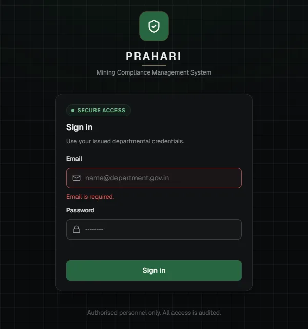
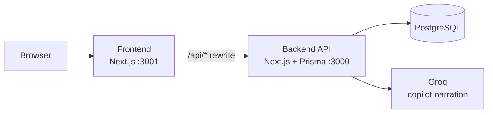

<div align="center">


# PRAHARI

**Mine compliance and safety monitoring, with explainable risk scoring and a copilot that only narrates real data.**

<br />


<br />
<sub>The sign-in screen. Everything behind it needs the backend and database running.</sub>

<br />
<br />

     

<br />

**[Run it](#run-it)** &nbsp;·&nbsp; **[Features](#features)** &nbsp;·&nbsp; **[Architecture](#architecture)** &nbsp;·&nbsp; **[Installation](#installation)** &nbsp;·&nbsp; **[API](#api)**

</div>

---

Mine safety and environmental compliance produces a constant stream of inspection reports, violations and sensor readings, often spread across paper records and disconnected systems. PRAHARI puts that data behind a role-based API and dashboard, raises alerts automatically when conditions are met, and keeps a tamper-evident audit trail of every action. It was built for the Smart India Hackathon.

Two design choices stand out:

- **Explainable risk scoring.** Inspection risk is a deterministic 0 to 1 score with listed reasons, not an opaque model output.
- **A copilot that can only narrate real data.** Questions are parsed deterministically, answered by RBAC-scoped database retrieval, and only then narrated by an LLM (Groq), so every number in an answer comes from the database.

## Run it

```bash
git clone https://github.com/Samudra-GITHub/PRAHARI.git
cd PRAHARI
cp .env.example .env        # fill in the empty secrets (openssl rand -hex 32)
docker compose up --build
```

Then open the frontend at <http://localhost:3001> and the API with Swagger UI at <http://localhost:3000/api-docs>. The stack seeds a fictional mine portfolio and four demo accounts by default (see `backend/scripts/seed.ts`).

## Features

<table>
  <tr>
    <td width="50%" valign="top">
      <h3>Compliance data, scoped by role</h3>
      <p>Mines, inspections, violations and environmental readings with full CRUD. Four roles (<code>FIELD_INSPECTOR</code>, <code>MINE_OFFICIAL</code>, <code>CORPORATE_ADMIN</code>, <code>REGULATOR</code>) see only the mines they should.</p>
    </td>
    <td width="50%" valign="top">
      <h3>Automatic alerts</h3>
      <p>Alerts are a first-class resource, created by five idempotent triggers: overdue inspections, repeated violations (3 or more in 90 days), high AI risk (0.8 or above), missing reports and environmental thresholds.</p>
    </td>
  </tr>
  <tr>
    <td width="50%" valign="top">
      <h3>Explainable risk scoring</h3>
      <p>A deterministic scorer weighs findings, severity keywords, the mine's compliance score and inspection status, and stores the score together with its reasons.</p>
    </td>
    <td width="50%" valign="top">
      <h3>A grounded copilot</h3>
      <p>Chat streams as newline-delimited JSON. The first message carries the real retrieved data so the UI can show evidence immediately; the model only narrates it.</p>
    </td>
  </tr>
  <tr>
    <td width="50%" valign="top">
      <h3>Tamper-evident audit log</h3>
      <p>Every action is audited. Each row stores a hash chained to the previous one, and <code>/api/audit-logs/verify</code> walks the chain to detect tampering.</p>
    </td>
    <td width="50%" valign="top">
      <h3>Standards-based API</h3>
      <p>JWT access tokens with rotating refresh tokens in an httpOnly cookie, bcrypt password hashing, an OpenAPI 3.1 spec at <code>/api/docs</code> and Swagger UI at <code>/api-docs</code>.</p>
    </td>
  </tr>
</table>

**Also:** per-mine compliance reports; a dashboard summary endpoint; a demo dataset and a smoke-test script in `backend/scripts/`.

## Tech stack

| Layer | Technology |
| :-- | :-- |
| Backend | Next.js 16 route handlers, TypeScript, Prisma 7, Bun |
| Database | PostgreSQL 16 (Docker), or embedded PGlite for local development |
| Frontend | Next.js 16, React 19, Tailwind CSS 4, Radix and shadcn |
| AI | A deterministic risk scorer, and Groq for copilot narration |
| Infrastructure | Docker Compose, Caddy (backend reverse-proxy config) |

## Architecture


```mermaid
flowchart LR
    U[Browser] --> F[Frontend<br/>Next.js :3001]
    F -->|/api/* rewrite| B[Backend API<br/>Next.js + Prisma :3000]
    B --> P[(PostgreSQL)]
    B --> G[Groq<br/>copilot narration]
```

The browser only talks to the frontend origin, which rewrites `/api/*` to the backend, so no CORS is needed and the refresh cookie stays same-origin. Every route is wrapped in `requireRole`, which verifies the JWT, loads the user and enforces the permission matrix; list queries are scoped to the mines a role may see. All responses use one envelope, `{ ok: true, data }` or `{ ok: false, error }`.

```text
PRAHARI/
├── backend/                  API: Next.js route handlers and Prisma
│   ├── src/app/api/          auth, mines, inspections, violations, alerts, reports,
│   │                         environmental-readings, audit-logs, ai, copilot, workflow, ...
│   ├── src/lib/              rbac, audit, ai-risk, workflow/, copilot/, openapi/, auth/
│   ├── prisma/schema.prisma
│   ├── scripts/              seed.ts, demo-dataset.ts, smoke.ts
│   └── Dockerfile  Caddyfile  docker-entrypoint.sh
├── frontend/                 Dashboard and copilot UI: login, (app)/ dashboard and copilot
├── abheeshta-frontend/       Unmodified create-next-app scaffold (not used by the stack)
├── docs/screenshots/
├── docker-compose.yml        db + backend + frontend
└── .env.example
```

### API

| Area | Routes |
| :-- | :-- |
| Auth | `/api/auth/login`, `register`, `refresh`, `logout`, `me` |
| Data | `/api/mines`, `inspections`, `violations`, `environmental-readings`, `alerts`, `reports` |
| Intelligence | `/api/ai/risk-score`, `/api/copilot/chat`, `/api/workflow/run`, `/api/dashboard/summary` |
| Governance | `/api/audit-logs`, `/api/audit-logs/verify` |
| Docs and health | `/api/docs`, `/api-docs`, `/api/health` |

## Installation

### Docker (recommended)

```bash
cp .env.example .env
docker compose up --build
```

| Service | URL |
| :-- | :-- |
| Frontend | <http://localhost:3001> |
| API and Swagger UI | <http://localhost:3000/api-docs> |

Use `http://localhost`, not a LAN IP, over plain HTTP, because the production refresh cookie is `Secure`. Set `SEED_DEMO_DATA=false` for any real use.

### Local development (without Docker)

Requires [Bun](https://bun.sh) for the backend.

```bash
# backend (port 3000), uses embedded PGlite when DATABASE_URL is unset
cd backend && bun install && bun run db:push && bun run seed && bun run dev

# frontend (port 3001), in another terminal
cd frontend && npm install && npm run dev -- -p 3001
```

### Environment

| Variable | Purpose |
| :-- | :-- |
| `POSTGRES_USER`, `POSTGRES_DB`, `POSTGRES_PASSWORD` | Database credentials for Compose |
| `JWT_ACCESS_SECRET`, `JWT_REFRESH_SECRET` | Token signing secrets (required) |
| `JWT_ACCESS_TTL`, `JWT_REFRESH_TTL` | Token lifetimes (defaults `15m`, `7d`) |
| `CRON_SECRET` | Authorises `POST /api/workflow/run` via the `x-cron-secret` header |
| `SEED_DEMO_DATA` | Seed demo accounts and data (default `true` in Compose) |
| `GROQ_API_KEY`, `GROQ_MODEL` | Copilot LLM. Read by the backend, but not forwarded by `docker-compose.yml` yet |
| `BACKEND_ORIGIN` | Frontend build argument for the `/api` rewrite target |

Compose refuses to start while a required secret is empty. Never commit `.env`.

### Deploy

`docker-compose.yml` runs PostgreSQL 16, the backend image (applies the Prisma schema on start, optionally seeds, serves the standalone build) and the frontend image. Real deployments should terminate TLS in front of the frontend.

## Limitations

- Screenshots show only the sign-in screen, because the rest of the UI needs the backend and a database.
- `backend/db/` contains a committed embedded-PGlite database (about 40 MB). It is excluded from Docker images and is better kept out of git.
- `abheeshta-frontend/` is an untouched scaffold.
- `GROQ_API_KEY` is not forwarded by `docker-compose.yml`, so the copilot does not work in the Compose stack yet.

## License

[MIT](LICENSE).
