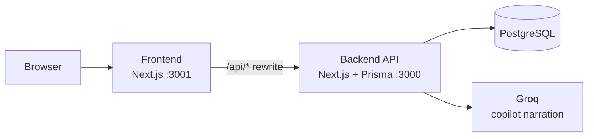

<div align="center">


# PRAHARI

**Mine compliance and safety monitoring with explainable risk scoring and a copilot that only narrates real data.**

Inspections · violations · environmental readings · automatic alerts · tamper-evident audit log · built for the Smart India Hackathon

<br />

**[Overview](#overview)** &nbsp;·&nbsp; **[Features](#features)** &nbsp;·&nbsp; **[Getting started](#getting-started)** &nbsp;·&nbsp; **[Architecture](#architecture)** &nbsp;·&nbsp; **[Structure](#project-structure)**

<br />

     

</div>

---

## Overview

Mine safety and environmental compliance produces a constant stream of inspection reports, violations and sensor readings, often spread across paper records and disconnected systems. PRAHARI centralises that data behind a role-based API and dashboard, raises alerts automatically when conditions are met, and keeps a tamper-evident audit trail of every action.

Two design choices stand out:

- **Explainable risk scoring.** Inspection risk is a deterministic 0 to 1 score with listed reasons, not an opaque model output.
- **A copilot that can only narrate real data.** Questions are parsed deterministically, answered by RBAC-scoped database retrieval, and only then narrated by an LLM (Groq), so every number in an answer comes from the database.

## Features

- **Mines, inspections, violations, environmental readings** with full CRUD and role-scoped access
- **Alerts** as a first-class resource, created by five idempotent workflow triggers: overdue inspections, repeated violations (3+ in 90 days), high AI risk (score of 0.8 or more), missing reports, and environmental thresholds
- **AI risk scoring** per inspection, with reasons
- **Copilot** chat that streams answers over retrieved, permission-filtered data
- **Reports**, including a per-mine compliance report
- **Audit log** with hash chaining and a verification endpoint
- **Authentication**: JWT access tokens, rotating refresh tokens in an httpOnly cookie, bcrypt password hashing
- **Four roles**: `FIELD_INSPECTOR`, `MINE_OFFICIAL`, `CORPORATE_ADMIN`, `REGULATOR`
- **OpenAPI 3.1** spec at `/api/docs` and Swagger UI at `/api-docs`

## Tech Stack

| Layer | Technology |
| --- | --- |
| Backend | Next.js 16 route handlers, TypeScript, Prisma 7, Bun |
| Database | PostgreSQL 16 (Docker) or embedded PGlite for local development |
| Frontend | Next.js 16, React 19, Tailwind CSS v4, Radix / shadcn |
| AI | Deterministic risk scorer, Groq for copilot narration |
| Infrastructure | Docker Compose, Caddy (backend reverse-proxy config) |

## Project Structure

```
PRAHARI/
├── backend/                  # API (Next.js route handlers + Prisma)
│   ├── src/app/api/          # auth, mines, inspections, violations, alerts, reports,
│   │                         #   environmental-readings, audit-logs, ai, copilot, workflow, ...
│   ├── src/lib/              # rbac, audit, ai-risk, workflow/, copilot/, openapi/, auth/
│   ├── prisma/schema.prisma
│   ├── scripts/              # seed.ts, demo-dataset.ts, smoke.ts
│   ├── db/                   # Local embedded PGlite data (see Known issues)
│   ├── Dockerfile  Caddyfile  docker-entrypoint.sh
│   └── tests/                # Container build check scripts
├── frontend/                 # Dashboard and copilot UI (Next.js)
│   ├── app/                  # login, (app)/ dashboard, copilot
│   ├── components/  services/  lib/  hooks/  types/
│   └── Dockerfile
├── abheeshta-frontend/       # Unmodified create-next-app scaffold (not used by the stack)
├── docker-compose.yml        # db + backend + frontend
└── .env.example
```

## Getting Started

### Docker (recommended)

```bash
cp .env.example .env     # fill in POSTGRES_PASSWORD, JWT_ACCESS_SECRET, JWT_REFRESH_SECRET, CRON_SECRET
docker compose up --build
```

| Service | URL |
| --- | --- |
| Frontend | http://localhost:3001 |
| API and Swagger UI | http://localhost:3000/api-docs |

Generate each secret with `openssl rand -hex 32`. Compose refuses to start while a required value is empty. Use `http://localhost`, not a LAN IP, over plain HTTP, because the production refresh cookie is `Secure`.

The stack seeds a fictional mine portfolio and four demo accounts by default (`SEED_DEMO_DATA=true`, see `backend/scripts/seed.ts`). Set `SEED_DEMO_DATA=false` for any real use.

### Local development (without Docker)

Requires [Bun](https://bun.sh) for the backend.

```bash
# backend (port 3000), uses embedded PGlite when DATABASE_URL is unset
cd backend
bun install
bun run db:push
bun run seed
bun run dev

# frontend (port 3001), in another terminal
cd frontend
npm install
npm run dev -- -p 3001
```

## Configuration

| Variable | Purpose |
| --- | --- |
| `POSTGRES_USER`, `POSTGRES_DB`, `POSTGRES_PASSWORD` | Database credentials for Compose |
| `JWT_ACCESS_SECRET`, `JWT_REFRESH_SECRET` | Token signing secrets (required) |
| `JWT_ACCESS_TTL`, `JWT_REFRESH_TTL` | Token lifetimes (defaults `15m`, `7d`) |
| `CRON_SECRET` | Authorises `POST /api/workflow/run` via the `x-cron-secret` header |
| `SEED_DEMO_DATA` | Seed demo accounts and data (default `true` in Compose) |
| `GROQ_API_KEY`, `GROQ_MODEL` | Copilot LLM. Read by the backend, but not forwarded by `docker-compose.yml` yet |
| `BACKEND_ORIGIN` | Frontend build argument for the `/api` rewrite target |

## Architecture


```mermaid
flowchart LR
    U[Browser] --> F[Frontend<br/>Next.js :3001]
    F -->|/api/* rewrite| B[Backend API<br/>Next.js + Prisma :3000]
    B --> P[(PostgreSQL)]
    B --> G[Groq<br/>copilot narration]
```

The browser only talks to the frontend origin, which rewrites `/api/*` to the backend, so no CORS is needed and the refresh cookie stays same-origin. Every route is wrapped in `requireRole`, which verifies the JWT, loads the user and enforces the permission matrix; list queries are scoped to the mines a role may see. All responses use one envelope, `{ ok: true, data }` or `{ ok: false, error }`. The audit log chains each row to the previous one by hash, and `/api/audit-logs/verify` walks the chain to detect tampering.

### Main endpoints

| Area | Routes |
| --- | --- |
| Auth | `/api/auth/login`, `register`, `refresh`, `logout`, `me` |
| Data | `/api/mines`, `inspections`, `violations`, `environmental-readings`, `alerts`, `reports` |
| Intelligence | `/api/ai/risk-score`, `/api/copilot/chat`, `/api/workflow/run`, `/api/dashboard/summary` |
| Governance | `/api/audit-logs`, `/api/audit-logs/verify` |
| Docs and health | `/api/docs`, `/api-docs`, `/api/health` |

## Deployment

`docker-compose.yml` runs PostgreSQL 16, the backend image (applies the Prisma schema on start, optionally seeds, serves the standalone build) and the frontend image. Real deployments should terminate TLS in front of the frontend.

## Known issues and future improvements

- `backend/db/` contains a committed embedded-PGlite database (about 40 MB). It is excluded from Docker images and is better kept out of git.
- `abheeshta-frontend/` is an untouched scaffold and could be removed or filled in.
- Forward `GROQ_API_KEY` through `docker-compose.yml` so the copilot works in the Compose stack.
- Expanded reporting and export formats

## License

MIT, see [LICENSE](LICENSE).
